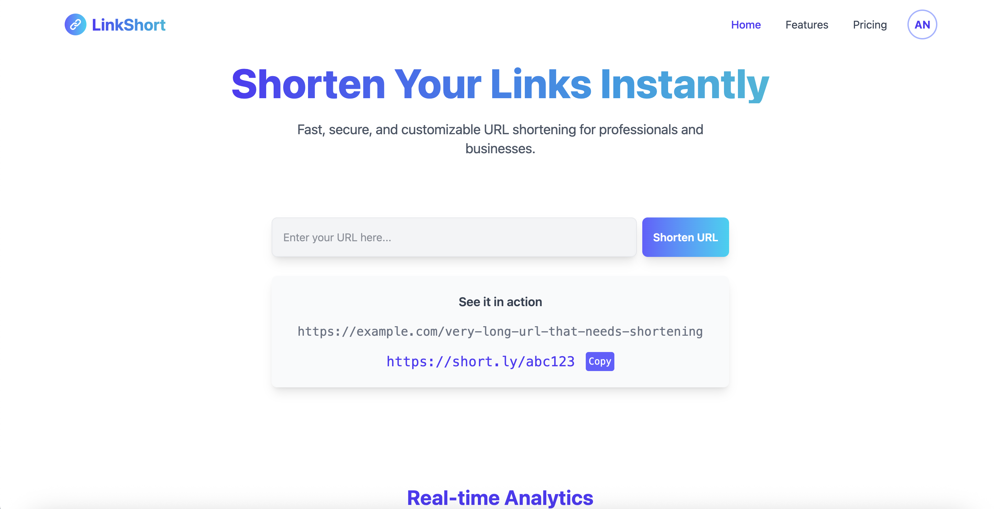
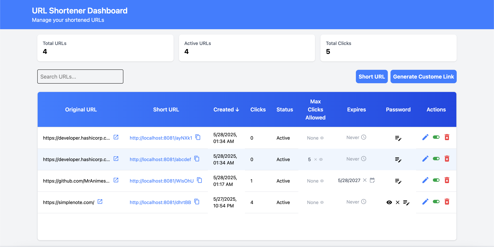
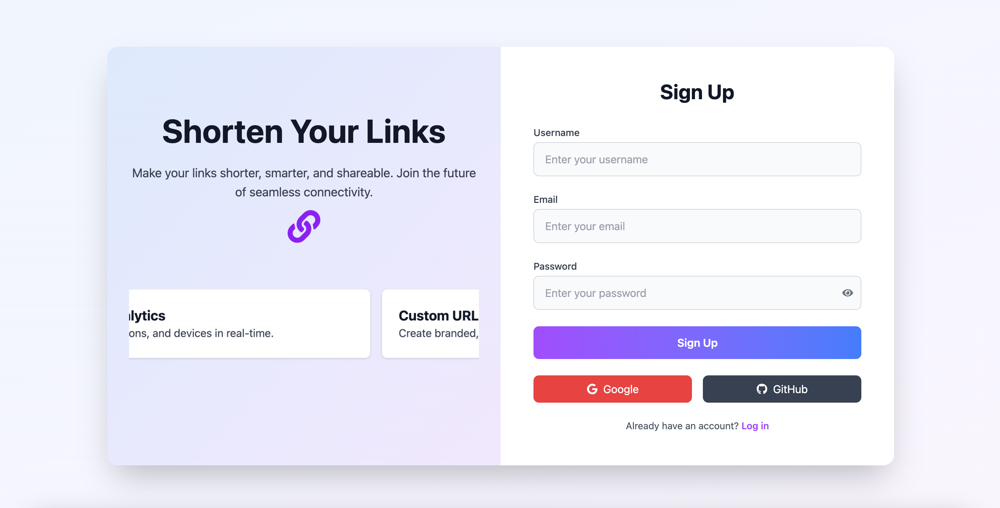
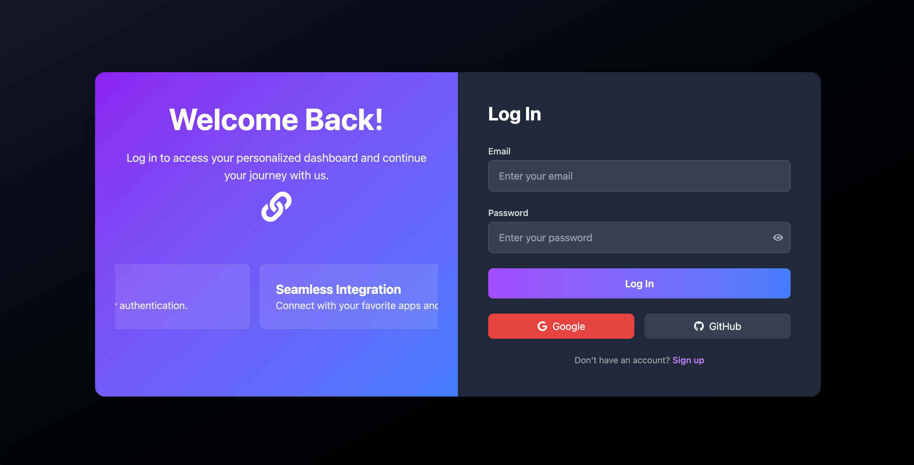

# 🔗 URL Shortener

A modern URL shortener application built with Java Spring Boot and React. Shorten long URLs into clean, shareable links with secure access.
Microservice and multischema based for scalability.

The screenshot is attached below.

## ✨ Features

- 🔐 JWT-based authentication using Spring Security
- 🔐 Login / Registration
- 📧 Email based verification
- 🔁 Shorten long URLs into compact short links
- 🔁 Shorten URLs with custom path
- ➤ Set/change/remove max click allowed
- 📆 Set/change/remove link expiration date
- 🔐 Set/change/remove password for urls
- 📝 Change url source 
- 📴 Activate / Deactivate url redirection
- 🗑️ Delete url
- 🔍 Redirect to original URLs
- ➤ See number of clicks & total clicks
- ⚙️ Service discovery via Consul
- 💻 Frontend in React + TypeScript + TailwindCSS
- 🛢️ PostgreSQL for data persistence
- 📊 Visit tracking / Analytics (coming soon)
- 🔜 Admin Dashboard 
- 🔜 Premium feature restriction
- 🔜 docker based setup (Coming soon)
- 🔜 google login (Coming soon)

## 📚 Tech Stack

**Backend**
- Java + Spring Boot
- Spring Security (JWT)
- PostgreSQL
- Consul for service discovery

**Frontend**
- React
- TypeScript
- TailwindCSS


<!-- ## 🧑‍💻 Getting Started

### Backend

```bash
cd backend
./mvnw spring-boot:run -->
   